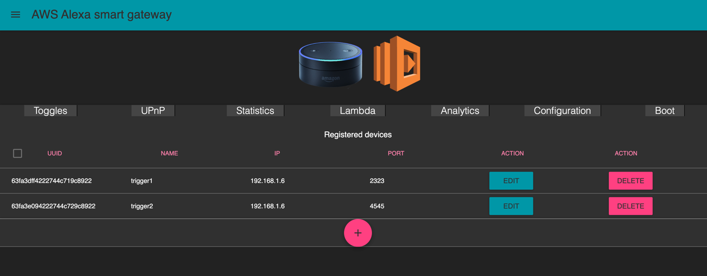
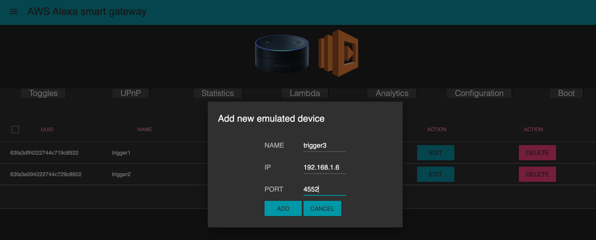
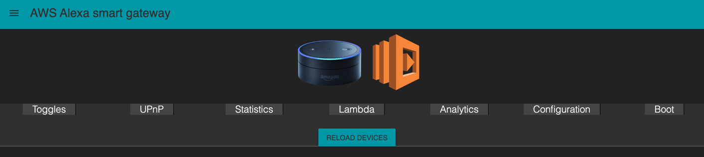
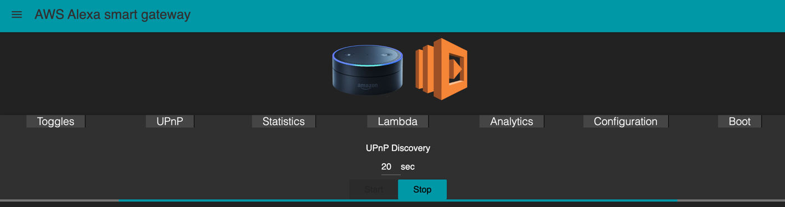
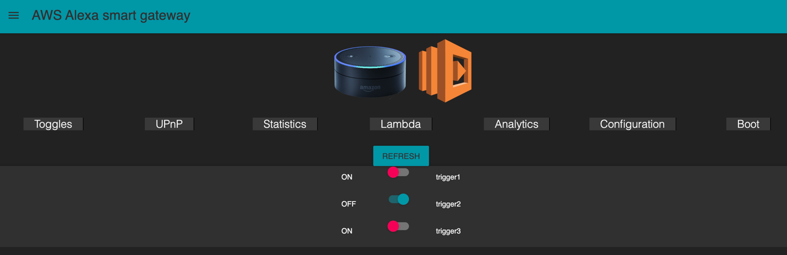

# Software Defined SmartGateway for AWS Alexa

---

JVM-base application fully compatible with AWS Alexa through WEMO-switch protocol:
- UPnP service discovery
- registration of Virtual devices (each VD can assign any function/script, etc.)
- Voice control from Alexa to each VD

> Application was created to run on Raspberry PI, some libs versions are downgraded to support sw that is running on PI.
CPU/memory resources of PI is not enough to start regular spring-boot application that is why [spark](https://sparkjava.com/) (lightweight server) is used

Additional info:
- [Youtube video, my talk about AWS Alexa (including demo of Software Defined Gateway)](https://www.youtube.com/watch?v=mq_vtk71LKE&t=3142s)
- [Google doc presentation slides](https://docs.google.com/presentation/d/1M-Rd8Z52mhnYyF986Eybjn1J4j0ovQfK1s7xH3Ukw-0/edit?usp=sharing)

---

## Installation

```shell
docker run -d -p 27017:27017 --name example-mongo mongo:2.6.1

gradle clean build

gradle run
```

---

## Access UI



---

## Add Virtual Device



---

## Reload server with newly registered devices


```shell
[Thread-17] INFO org.eclipse.jetty.server.AbstractConnector - Started ServerConnector@6c1039e8{HTTP/1.1,[http/1.1]}{0.0.0.0:2323}
[Thread-19] INFO org.eclipse.jetty.server.AbstractConnector - Started ServerConnector@7ddef6ea{HTTP/1.1,[http/1.1]}{0.0.0.0:4552}
[Thread-18] INFO org.eclipse.jetty.server.AbstractConnector - Started ServerConnector@2f0ef9f2{HTTP/1.1,[http/1.1]}{0.0.0.0:4545}
[Thread-17] INFO org.eclipse.jetty.server.Server - Started @84644ms
[Thread-19] INFO org.eclipse.jetty.server.Server - Started @84644ms
[Thread-18] INFO org.eclipse.jetty.server.Server - Started @84645ms
{ "_id" : { "$oid" : "63fa3e3e4222744c749c8922"} , "localDateTime" : "2023-02-25T18:58:38.478" , "record" : "Stopped 0 device emulated services."}
{ "_id" : { "$oid" : "63fa3e3e4222744c759c8922"} , "localDateTime" : "2023-02-25T18:58:38.488" , "record" : "Starting emulated devices 3"}

```

---

## Start UPnP discovery process so Alexa can connect 'Alexa, find my devices'



```shell
[qtp974491681-29] INFO ua.in.smartjava.upnp.UPnPDiscoverable - UPnP Discovery change state to: true
[pool-1-thread-1] INFO ua.in.smartjava.upnp.UPnPDiscoverable - UPnP Discovery started...
[pool-1-thread-1] INFO ua.in.smartjava.upnp.UPnPDiscoverable - UPnP Discovery stopped...
{ "_id" : { "$oid" : "63fa3e624222744c769c8922"} , "localDateTime" : "2023-02-25T18:59:14.463" , "record" : "Started discovery of 3 devices for 20 seconds."}

```

---

## Toggles can be controled by Alexa Voice commands, also from UI



---

## Contributing

Contributions are welcome!

---

## License

This project is licensed under the MIT License - see the [LICENSE](LICENSE) file for details.
